<div align="center">

# 🚀 Terminus

### **The AI-Powered Terminal That Speaks Your Language**

[](https://www.electronjs.org/)
[](https://tambo.co)
[](https://react.dev/)
[](https://www.typescriptlang.org/)
[](./LICENSE)

**Stop memorizing commands. Start having conversations with your terminal.**

Terminus is a revolutionary terminal application powered by **[Tambo AI](https://tambo.co)** that transforms raw command-line output into beautiful, interactive visualizations. Just describe what you want in natural language, and watch as AI renders rich UI components on a drag-and-drop canvas.

[Features](#-key-features) · [Screenshots](#-screenshots) · [Getting Started](#-getting-started) 

---


[🎥 Video Here](https://www.youtube.com/watch?v=_jMZ1NZNU6c)

</div>

---

## ✨ What is Terminus?

**Terminus** reimagines the terminal experience by combining the power of traditional shell access with modern AI-driven generative UI. Instead of parsing dense text output, you interact with intelligent, data-rich components that understand context.

### The Problem
Traditional terminals are powerful but unintuitive:
- ❌ Memorize dozens of commands and flags
- ❌ Parse walls of unstructured text
- ❌ Context-switch between terminal and GUI tools
- ❌ No visualization for complex data

### The Solution
Terminus uses **Tambo AI** to bridge the gap:
- ✅ **Natural language input** — Ask questions like you would a colleague
- ✅ **Intelligent component selection** — AI picks the right visualization automatically
- ✅ **Interactive components** — Files, git history, containers, and more as rich UI
- ✅ **Drag-and-drop canvas** — Arrange multiple visualizations in tabs
- ✅ **Real shell execution** — Backed by node-pty for authentic terminal behavior

### Example Interactions

| You Ask | Tambo AI Does | You Get |
|---------|---------------|---------|
| *"Show me what's in my Developer folder"* | Calls `listFiles` tool → Renders `FileGrid` | Interactive file browser with sorting, icons, and navigation |
| *"Any Docker containers running?"* | Calls `getDockerContainers` → Renders `ContainerDash` | Live dashboard with start/stop controls |
| *"Show me recent commits"* | Calls `getGitHistory` → Renders `GitNetwork` | Visual commit graph with branches and authors |
| *"Create a new folder called 'my-project'"* | Calls `createFolder` tool | Executes securely with confirmation |

---

## 📸 Screenshots

### Interactive File Navigation


### Git History Visualization


### Docker Container Management


### System Performance Monitoring


---


### 🤖 **AI-Powered Intelligence**
- **Natural Language Processing** — Describe your intent in plain English, no command syntax required
- **Smart Component Selection** — Tambo AI automatically chooses the optimal visualization for your data
- **Context Awareness** — AI understands follow-up questions and maintains conversation history

### 🎨 **Rich Generative UI Components**
- **FileGrid** — Interactive file browser with sorting, filtering, and visual file type icons
- **GitNetwork** — Commit history visualized as a graph with branches and merge points
- **ContainerDash** — Docker container management with live status and controls
- **SystemMonitor** — Real-time CPU, memory, and process metrics with gauges
- **JsonExplorer** — Collapsible JSON tree viewer with syntax highlighting
- **PackageInfo** — Package.json analyzer with dependency insights

### 🛠️ **Powerful Backend Integration**
- **11 AI Tools** — File operations, git commands, Docker control, system monitoring
- **Secure File Operations** — Create, delete, rename, and copy files with AI assistance
- **Real Shell Execution** — Built on node-pty for authentic terminal behavior
- **Cross-Platform** — Native integrations for macOS, Windows, and Linux

### 🎪 **Canvas Workspace**
- **Drag-and-Drop** — Arrange components freely on an infinite canvas
- **Multi-Tab Support** — Create separate workspaces for different projects
- **Component Persistence** — Your layout is saved and restored between sessions
- **Responsive Layout** — Components adapt to canvas size and arrangement

---

## 🔄 How Terminus Works

### Workflow Diagram

```mermaid
flowchart LR
    A[🗣️ User Input<br/>Natural Language] --> B[🤖 Tambo AI<br/>Intent Analysis]
    B --> C[🔧 Tool Call<br/>Fetch Data]
    C --> D[📊 Component<br/>Selection]
    D --> E[🎨 Canvas<br/>Render]
    E --> F[👆 User<br/>Interaction]
    F -.-> A
    
    style B fill:#6366f1,stroke:#4f46e5,color:#fff
    style D fill:#6366f1,stroke:#4f46e5,color:#fff
    style E fill:#10b981,stroke:#059669,color:#fff
```



**Example Flow**: *"Show me my Developer folder"* → Tambo calls `listFiles` tool → Fetches directory data via IPC → Selects `FileGrid` component → Renders on canvas → User drags/sorts/navigates

---

## 🧰 Technology Stack

<div align="center">

### Frontend Layer
| Technology | Version | Purpose |
|-----------|---------|---------|
|  | 18.3.0 | UI component framework |
|  | 5.6 | Type-safe development |
|  | 6.0 | Lightning-fast build tool |
|  | 3.4 | Utility-first CSS framework |

### AI & Rendering
| Technology | Version | Purpose |
|-----------|---------|---------|
|  | 0.69.1 | Generative UI engine |
| **Zod** | 3.24 | Schema validation for tools |
| **@dnd-kit** | 7.0 | Drag-and-drop canvas |
| **Framer Motion** | 11.15 | Smooth animations |

### Desktop & Shell
| Technology | Version | Purpose |
|-----------|---------|---------|
|  | 40.1.0 | Native desktop app framework |
| **node-pty** | 1.1 | Real PTY shell execution |
| **xterm.js** | 5.5 | Terminal emulator (Normal mode) |


</div>

---

## 🚀 Getting Started

### Prerequisites

Before you begin, ensure you have the following installed:

- **Node.js** ≥ 18.0.0 ([Download](https://nodejs.org/))
- **npm** ≥ 9.0.0 (comes with Node.js)
- **Git** ([Download](https://git-scm.com/))
- A **[Tambo AI API key](https://tambo.co)** (Required for AI features)

### Quick Start

####  Clone the Repository

```bash
git clone https://github.com/anuj123upadhyay/terminus.git
cd terminus
```

####  Configure Environment

Create your environment configuration:

```bash
# Copy the example environment file
cp .env.example .env
```

Edit `.env` and add your Tambo API key:

```env
VITE_TAMBO_API_KEY=your_tambo_api_key_here
VITE_TAMBO_URL=https://api.tambo.ai  # Optional: custom API endpoint
```

#### Running the dev environment

```bash
npm run electron:dev
```


> 💡 **Get your API key**: Sign up at [tambo.co](https://tambo.co) to obtain your API key


### Available Components

| Component | Purpose | Trigger Examples |
|-----------|---------|------------------|
| **FileGrid** | Interactive file browser with sorting and icons | *"show my documents"*, *"list files in Desktop"* |
| **GitNetwork** | Visual commit history graph | *"recent commits"*, *"git history"*, *"show git log"* |
| **ContainerDash** | Docker container management | *"docker status"*, *"any containers running?"* |
| **SystemMonitor** | CPU, memory, and process metrics | *"system stats"*, *"how's my CPU?"*, *"show processes"* |
| **JsonExplorer** | Collapsible JSON tree viewer | *"show config.json"*, *"display this JSON"* |


Contributions are what make the open-source community amazing! We welcome:

- 🐛 **Bug reports** — Help us identify and fix issues
- 💡 **Feature requests** — Suggest new GenUI components or tools
- 🔧 **Pull requests** — Contribute code improvements
- 📖 **Documentation** — Improve guides and examples

### How to Contribute

1. Fork the repository
2. Create your feature branch (`git checkout -b feature/AmazingFeature`)
3. Commit your changes (`git commit -m 'Add some AmazingFeature'`)
4. Push to the branch (`git push origin feature/AmazingFeature`)
5. Open a Pull Request


---

## 📄 License

This project is licensed under the **MIT License** — see the [LICENSE](./LICENSE) file for details.


---

## 🙏 Acknowledgments

- **[Tambo AI](https://tambo.co)** — For pioneering generative UI technology
- **[Electron](https://www.electronjs.org/)** — For enabling cross-platform desktop apps
- **[node-pty](https://github.com/microsoft/node-pty)** — For real PTY shell integration
- **Analytics Template** — For the drag-and-drop canvas inspiration
- **Open Source Community** — For the amazing tools and libraries

---

## 📞 Support & Community

- **Issues**: [GitHub Issues](https://github.com/anuj123upadhyay/terminus/issues)
- **Discussions**: [GitHub Discussions](https://github.com/anuj123upadhyay/terminus/discussions)
- **Tambo Docs**: [tambo.ai/docs](https://tambo.co)


---

<div align="center">

### **Built with ❤️ using [Tambo AI](https://tambo.co)**

**Generative UI for the Modern Terminal**

---

**If you found Terminus helpful, please consider:**

⭐ **Starring this repository**  
🐦 **Sharing on Twitter**  
💬 **Submitting feedback**

---

Made by developers, for developers.

---
## 📞 Contact & Support

<div align="center">

**Built with ❤️ for The UI Strikes Back by WeMakeDevs**

### 👥 Team Members

**Anuj Kumar Upadhyay**

[](https://github.com/anuj123upadhyay)
[](mailto:anuju760@gmail.com)
[](https://linkedin.com/in/anuj1upadhyay)
[](https://anuj1.hashnode.dev)
[](https://x.com/anuj123upadhyay)

**Mohit Upadhyay**

[](https://github.com/mohit5upadhyay)
[](mailto:upadhyaym7060@gmail.com)
[](https://linkedin.com/in/mohit5upadhyay)[](https://mohit5upadhyay.hashnode.dev)
[](https://x.com/mohit5upadhyay)

</div>

---     
